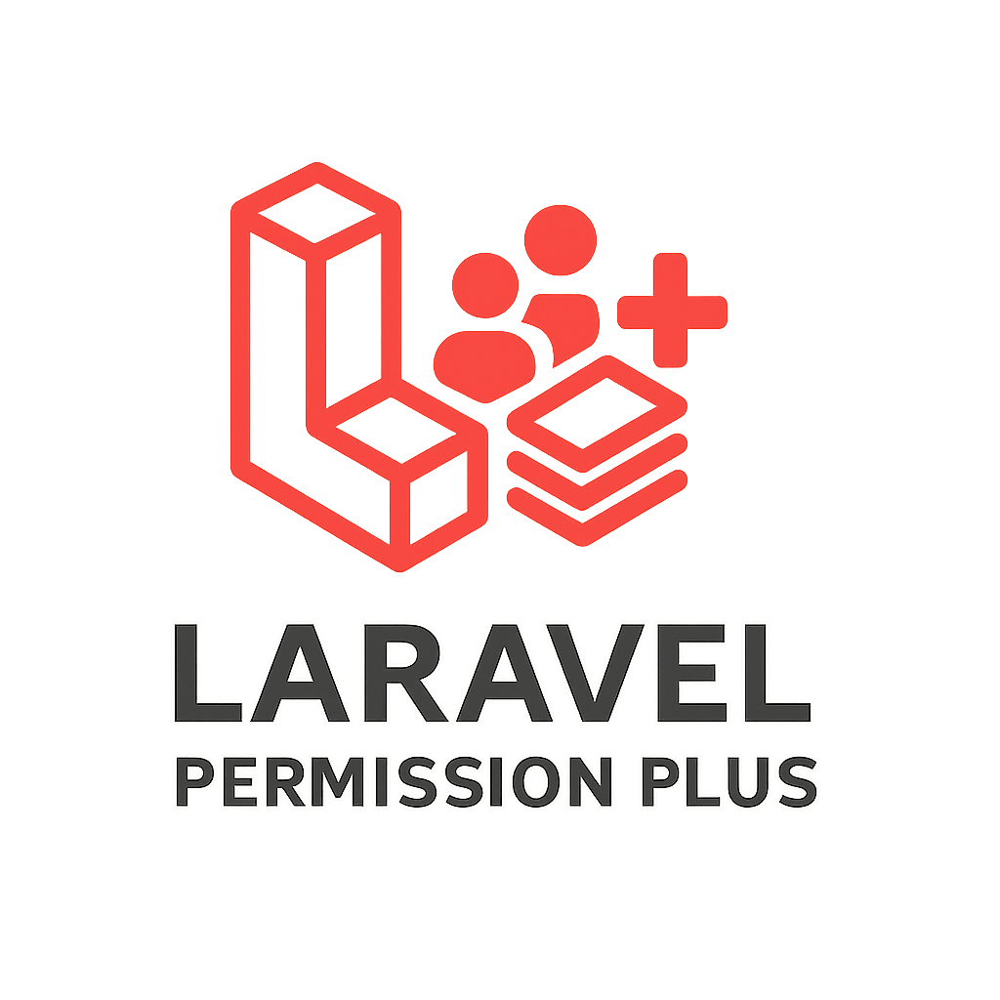

# Laravel Permission Plus

<p align="center">
	
</p>

**Author:** [Eslam Faroug](mailto:eslamfaroug3@gmail.com)


An advanced permission, role, and group management system for Laravel (RBAC + group-based access) with multilingual support, polymorphic relationships, and caching.

---

## Introduction

**laravel-permission-plus** is a powerful package for managing permissions, roles, and groups in Laravel applications. It features full multilingual support, polymorphic relationships, automatic caching, and high customizability. Build flexible and complex access control systems with ease.

---

## Key Features

- Advanced management for permissions, roles, and groups
- Full multilingual support (JSON columns)
- Polymorphic relationships: assign permissions/roles/groups to any model
- Automatic caching for high performance (auto-clear on changes)
- Simple API (Traits, Facades, Services)
- Multi-guard support
- Fully customizable table/model names
- Extensible and override-friendly
- Nested/grouped access control

---

## Core Components

### Models
- **Permission**: Represents a single permission, multilingual name, linked to PermissionGuard and Roles
- **Role**: Represents a role, multilingual name, linked to Permissions and Groups
- **Group**: Represents a group (team, department, etc.), multilingual name/description, linked to members and roles
- **PermissionGuard**: Permission guard (integrates with Laravel Auth)

### Traits
- **HasAccessControl**: Adds assignment and checking of permissions/roles/groups to any model
- **HasTranslatable**: Provides dynamic translation for attributes

### Services
- **AccessControlManager**: Central manager for repositories (Roles, Groups, Guards)

### Facade
- **Permission**: Unified interface for querying permissions, roles, and groups

---

## Usage Examples

```php
// Assign a role to a user
$user->assignRole('editor');

// Check for a permission
$user->hasPermissionTo('edit-articles');

// Assign user to a group
$user->assignToGroups('content-team');

// Get all permissions for a group
$group->getAllPermissions();
```

---

## Installation & Setup

1. **Install via Composer**
   ```bash
   composer require eslamfaroug/laravel-permission-plus
   ```
2. **Publish config and migrations**
   ```bash
   php artisan vendor:publish --provider="EslamFaroug\\PermissionPlus\\Providers\\PermissionServiceProvider" --tag="permission-plus-config"
   php artisan vendor:publish --provider="EslamFaroug\\PermissionPlus\\Providers\\PermissionServiceProvider" --tag="permission-plus-migrations"
   ```
3. **Run migrations**
   ```bash
   php artisan migrate
   ```
4. **Run tests**
   ```bash
   composer test
   # or
   ./vendor/bin/phpunit
   ```

---

## Customization & Integration

- Change table/model names via `config/permission-plus.php`
- Multi-guard support and Laravel Auth integration
- All models are extendable/overridable
- Cache is auto-cleared on any permission/role/group change
- Always use provided methods (assignRole, hasPermissionTo, inGroup, etc.) to keep cache in sync
- Full multilingual support for display names (e.g., `name['en']`, `name['ar']`)

---

## Managing Guards, Roles, and Groups

This package provides full CRUD (Create, Read, Update, Delete) operations for guards, roles, and groups, as well as listing and viewing details. You can manage them using Eloquent models, repositories, or the provided service/facade. Below are explanations and code examples for each:

### Guards
**Guards** define the context or authentication driver for permissions (e.g., 'web', 'api').

#### List all guards
```php
use EslamFaroug\PermissionPlus\Models\PermissionGuard;
$guards = PermissionGuard::all();
// or via service
$guards = app('permission-plus')->guards()->all();
```

#### Create a new guard
```php
$guard = PermissionGuard::create([
    'name' => ['en' => 'Web', 'ar' => 'ويب'],
    'key' => 'web',
]);
```

#### Update a guard
```php
$guard = PermissionGuard::find(1);
$guard->name = ['en' => 'API', 'ar' => 'واجهة برمجية'];
$guard->save();
```

#### Delete a guard
```php
$guard = PermissionGuard::find(1);
$guard->delete();
```

#### Show a guard
```php
$guard = PermissionGuard::find(1);
```

---

### Roles
**Roles** are collections of permissions that can be assigned to users or groups.

#### List all roles
```php
use EslamFaroug\PermissionPlus\Models\Role;
$roles = Role::all();
// or via service
$roles = app('permission-plus')->roles()->all();
```

#### Create a new role
```php
$role = Role::create([
    'name' => ['en' => 'Editor', 'ar' => 'محرر'],
    'key' => 'editor',
]);
```

#### Update a role
```php
$role = Role::find(1);
$role->name = ['en' => 'Admin', 'ar' => 'مدير'];
$role->save();
```

#### Delete a role
```php
$role = Role::find(1);
$role->delete();
```

#### Show a role
```php
$role = Role::find(1);
```

---

### Groups
**Groups** represent teams, departments, or any logical grouping of users/models.

#### List all groups
```php
use EslamFaroug\PermissionPlus\Models\Group;
$groups = Group::all();
// or via service
$groups = app('permission-plus')->groups()->all();
```

#### Create a new group
```php
$group = Group::create([
    'name' => ['en' => 'Content Team', 'ar' => 'فريق المحتوى'],
    'key' => 'content-team',
    'description' => ['en' => 'Handles all content', 'ar' => 'يدير كل المحتوى'],
]);
```

#### Update a group
```php
$group = Group::find(1);
$group->name = ['en' => 'Marketing', 'ar' => 'تسويق'];
$group->save();
```

#### Delete a group
```php
$group = Group::find(1);
$group->delete();
```

#### Show a group
```php
$group = Group::find(1);
```

---

### Notes
- All CRUD operations support multilingual fields (arrays for `name`, `description`).
- You can use Eloquent, the service (`app('permission-plus')`), or repositories for advanced queries.
- Always clear cache after direct DB changes.
- Use the provided methods for assignments and checks to ensure cache consistency.

---

## Advanced Notes

- After direct DB changes, clear cache manually
- All relationships are polymorphic: assign permissions/roles/groups to any model (User, Employee, Client, ...)
- Fields, relationships, and services are fully extendable

---

## License

MIT © Eslam Faroug
